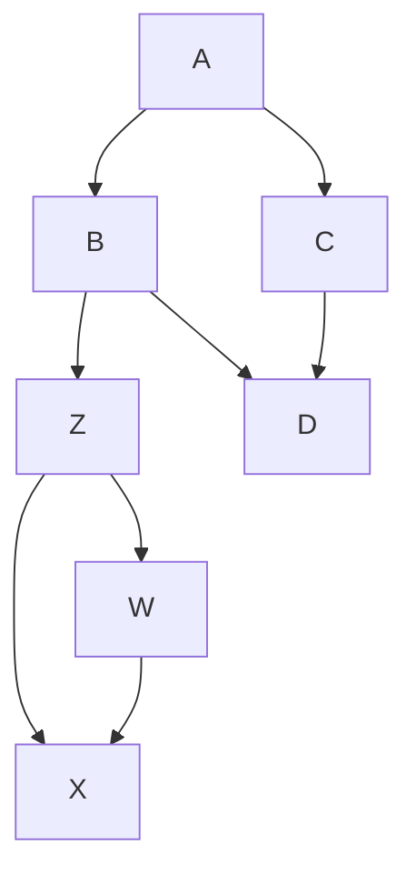
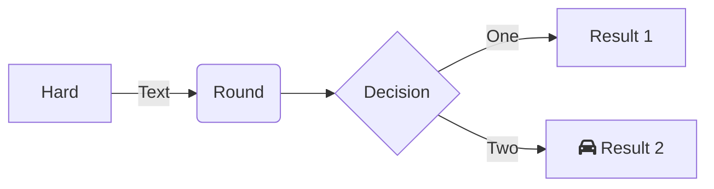
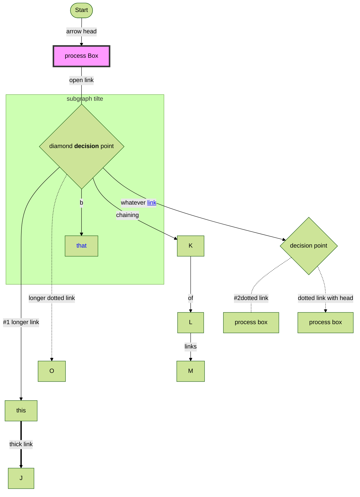

# Marmaid test

- [github feature](https://github.com/mermaid-js/mermaid#readme)
- [official mermaid doc](https://github.blog/2022-02-14-include-diagrams-markdown-files-mermaid/)
- [Flowcharts - Basic Syntax](https://mermaid-js.github.io/mermaid/#/flowchart)

## alternatives

- https://plantuml.com/link
- https://store.omnigroup.com/omnigraffle
- https://www.gliffy.com/
- https://news.ycombinator.com/item?id=18788244

# advanced

[https://mermaid-js.github.io/](https://mermaid-js.github.io/mermaid-live-editor/edit/#pako:eNqtk02P2jAQhv_KKAjRSiQcqCrVFVQFVt22u6rU7Q04mHhCXBw7sifNrhL-e20SYJF6rE_j8TMffsduotQIjFg0HDZSS2LQwEiZ_QP-QTViMBK4q_ajMYwoxwKDJzMWHY3gCMfhcKP3lpc5_FptNPj1-c36ibil7VuI43nLrTU15MhFC4t1aU2KzsHCPG87fOGpuDUlalBSH1pYNkLywmgBAlPppNFQGqnp2PHLwIfEyug92j5otaZcuu0FSZLkighDhKInf3SMq3Zd2xeDpCLsDsMS0mJKofrDz6t3ebrTroU7X5DTljHmTIGp4s51FGpxbRTSnHtN9T6EwffgMdnJfgh26Midto_XmHlb-8xefNvCffNPDe79BeP25lpfLtLuvLQBeoXOX7NQS8r7gXy9ieoiVjCbzeat1zM99Mm_dSfDYdgjpKYoUFPnTFXgFpBbzGAT5UQlm0zquk60uV2Jj5tsol5_elHowzKpFBtkH7KxI2sOyAbT6bS341oKytm78vk6AN9DZk3BIBRyvlKBtuBSxL9dsvcXq3aJNGfnZDDJlKn9ECx9kmIWivphxDzW_smf-_ejW_neL3O89PT-43-qmzoXn1Kji8ZRD_kf14T8m-j0rzYR86bAjFeKgkpHj1al8E_hTkgyNmIZVw7HEa_IPL3oNGJkKzxDK8n9Oy566vgXzU0_jw)

###### #1 longer link

https://mermaid-js.github.io/mermaid-live-editor/edit/#pako:eNqtk02P2jAQhv_KKAjRSiQcqCrVFVQFVt22u6rU7Q04mHhCXBw7sifNrhL-e20SYJF6rE_j8TMffsduotQIjFg0HDZSS2LQwEiZ_QP-QTViMBK4q_ajMYwoxwKDJzMWHY3gCMfhcKP3lpc5_FptNPj1-c36ibil7VuI43nLrTU15MhFC4t1aU2KzsHCPG87fOGpuDUlalBSH1pYNkLywmgBAlPppNFQGqnp2PHLwIfEyug92j5otaZcuu0FSZLkighDhKInf3SMq3Zd2xeDpCLsDsMS0mJKofrDz6t3ebrTroU7X5DTljHmTIGp4s51FGpxbRTSnHtN9T6EwffgMdnJfgh26Midto_XmHlb-8xefNvCffNPDe79BeP25lpfLtLuvLQBeoXOX7NQS8r7gXy9ieoiVjCbzeat1zM99Mm_dSfDYdgjpKYoUFPnTFXgFpBbzGAT5UQlm0zquk60uV2Jj5tsol5_elHowzKpFBtkH7KxI2sOyAbT6bS341oKytm78vk6AN9DZk3BIBRyvlKBtuBSxL9dsvcXq3aJNGfnZDDJlKn9ECx9kmIWivphxDzW_smf-_ejW_neL3O89PT-43-qmzoXn1Kji8ZRD_kf14T8m-j0rzYR86bAjFeKgkpHj1al8E_hTkgyNmIZVw7HEa_IPL3oNGJkKzxDK8n9Oy566vgXzU0_jw

###### #2 dotted link

more about [dotted links](https://mermaid-js.github.io/mermaid/#/flowchart?id=dotted-link)
