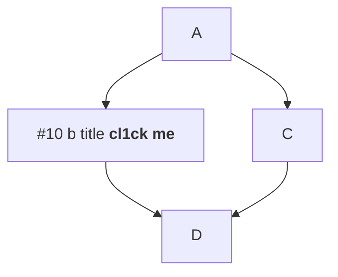
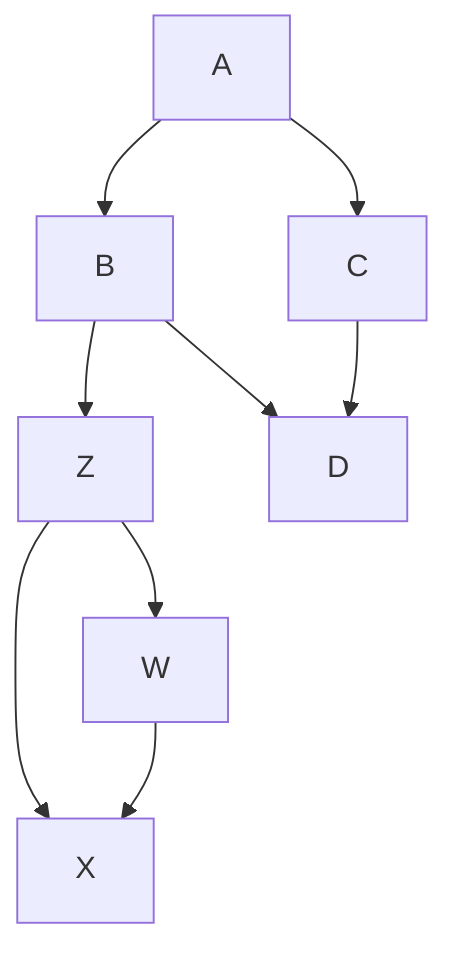
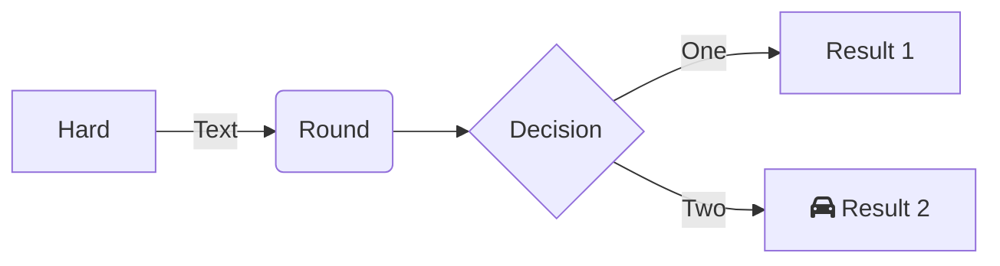
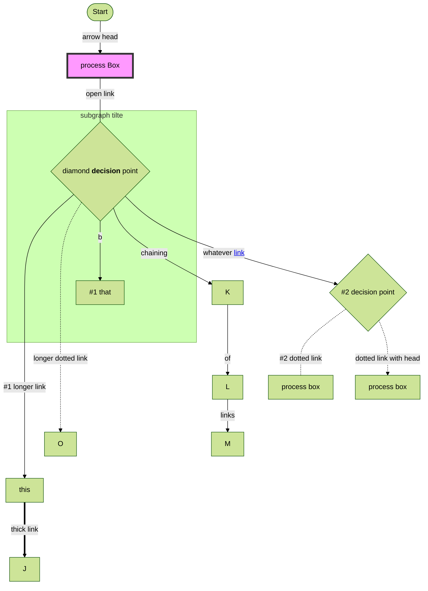
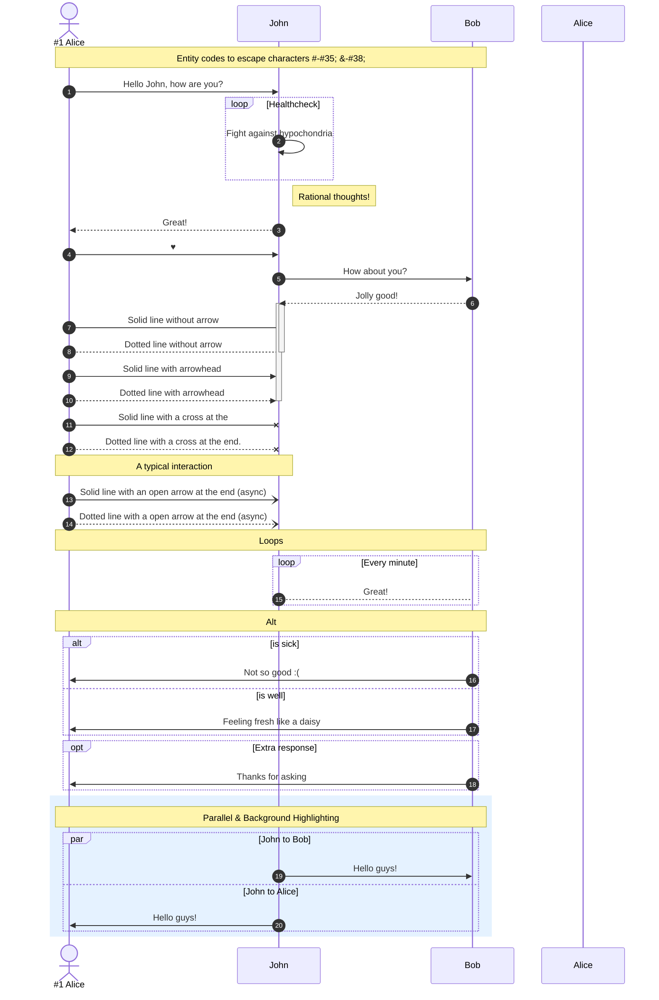

# Purpose of the script

Stript was create to improve navigation on the github page rendering mermaid containing markdown md file.

# Installation

Install Tampermonkey

- [chrome](https://chrome.google.com/webstore/detail/tampermonkey/dhdgffkkebhmkfjojejmpbldmpobfkfo/related)
- [firefox](https://addons.mozilla.org/en-GB/firefox/addon/tampermonkey/)

then install this script

https://greasyfork.org/en/scripts/441574-github-mermaid

... then reload this github page to see it in action against mermaid markdown

# Features

## \* Permalink on the same page

It is possible to prefix any label on the chart with "hash" and "number" (example "#2").

This part of label will be transformed into a red link with permalink which once clicked will scroll to header on the same page where that header also starts with the same "hash" and "number" (In case of above example it header will have to start from exactly with "#2")

Example:

~~~

~~~

## \* Coloring links

By default when [hyperlink](https://mermaid-js.github.io/mermaid/#/flowchart?id=interaction) is defined on the chart it's not really clear that it's a link. It lack styling typical for hyperlinks (blue color), it is only visible that it's a link once one hover over it, mouse cursor will change to state "pointer"

This script changes that to make links visible as regular blue links.

## \* Generating links to live editor

This script also generates special link on each chart which once clicked opens new tab in the browser with this chart in [live editor](https://mermaid-js.github.io/mermaid-live-editor)

# More materials about mermaid itself

- [Mermaid github homepage](https://github.com/mermaid-js/mermaid#readme)
- [Github announcment to provide native support for mermaid](https://github.blog/2022-02-14-include-diagrams-markdown-files-mermaid/)
- [Flowcharts Basic Syntax - doc page](https://mermaid-js.github.io/mermaid/#/flowchart)
- reverse engineered [url decoder](https://stopsopa.github.io/mermaid/)

## alternatives

- https://plantuml.com/link
- https://store.omnigroup.com/omnigraffle
- https://www.gliffy.com/
- https://news.ycombinator.com/item?id=18788244

# some more examples

~~~

~~~

~~~

~~~

~~~

~~~

# advanced

[https://mermaid-js.github.io/](https://mermaid-js.github.io/mermaid-live-editor/edit/#pako:eNqtk02P2jAQhv_KKAjRSiQcqCrVFVQFVt22u6rU7Q04mHhCXBw7sifNrhL-e20SYJF6rE_j8TMffsduotQIjFg0HDZSS2LQwEiZ_QP-QTViMBK4q_ajMYwoxwKDJzMWHY3gCMfhcKP3lpc5_FptNPj1-c36ibil7VuI43nLrTU15MhFC4t1aU2KzsHCPG87fOGpuDUlalBSH1pYNkLywmgBAlPppNFQGqnp2PHLwIfEyug92j5otaZcuu0FSZLkighDhKInf3SMq3Zd2xeDpCLsDsMS0mJKofrDz6t3ebrTroU7X5DTljHmTIGp4s51FGpxbRTSnHtN9T6EwffgMdnJfgh26Midto_XmHlb-8xefNvCffNPDe79BeP25lpfLtLuvLQBeoXOX7NQS8r7gXy9ieoiVjCbzeat1zM99Mm_dSfDYdgjpKYoUFPnTFXgFpBbzGAT5UQlm0zquk60uV2Jj5tsol5_elHowzKpFBtkH7KxI2sOyAbT6bS341oKytm78vk6AN9DZk3BIBRyvlKBtuBSxL9dsvcXq3aJNGfnZDDJlKn9ECx9kmIWivphxDzW_smf-_ejW_neL3O89PT-43-qmzoXn1Kji8ZRD_kf14T8m-j0rzYR86bAjFeKgkpHj1al8E_hTkgyNmIZVw7HEa_IPL3oNGJkKzxDK8n9Oy566vgXzU0_jw)

~~~

~~~

## Sequence Diagram

~~~

~~~

###### #10 header to scroll

Here is content under header to which user will be scrolled once he click process box with title "#10 b title" on above flow chart.

###### #1 longer link

https://mermaid-js.github.io/mermaid-live-editor/edit/#pako:eNqtk02P2jAQhv_KKAjRSiQcqCrVFVQFVt22u6rU7Q04mHhCXBw7sifNrhL-e20SYJF6rE_j8TMffsduotQIjFg0HDZSS2LQwEiZ_QP-QTViMBK4q_ajMYwoxwKDJzMWHY3gCMfhcKP3lpc5_FptNPj1-c36ibil7VuI43nLrTU15MhFC4t1aU2KzsHCPG87fOGpuDUlalBSH1pYNkLywmgBAlPppNFQGqnp2PHLwIfEyug92j5otaZcuu0FSZLkighDhKInf3SMq3Zd2xeDpCLsDsMS0mJKofrDz6t3ebrTroU7X5DTljHmTIGp4s51FGpxbRTSnHtN9T6EwffgMdnJfgh26Midto_XmHlb-8xefNvCffNPDe79BeP25lpfLtLuvLQBeoXOX7NQS8r7gXy9ieoiVjCbzeat1zM99Mm_dSfDYdgjpKYoUFPnTFXgFpBbzGAT5UQlm0zquk60uV2Jj5tsol5_elHowzKpFBtkH7KxI2sOyAbT6bS341oKytm78vk6AN9DZk3BIBRyvlKBtuBSxL9dsvcXq3aJNGfnZDDJlKn9ECx9kmIWivphxDzW_smf-_ejW_neL3O89PT-43-qmzoXn1Kji8ZRD_kf14T8m-j0rzYR86bAjFeKgkpHj1al8E_hTkgyNmIZVw7HEa_IPL3oNGJkKzxDK8n9Oy566vgXzU0_jw

###### #2 dotted link

more about [dotted links](https://mermaid-js.github.io/mermaid/#/flowchart?id=dotted-link)
